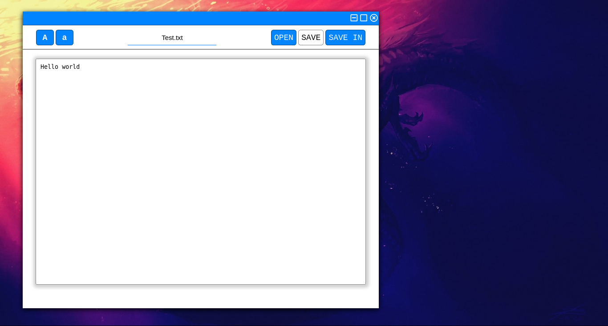

# Simple Text editor

Just a text editor for funny

## Supported Platforms

- [x] Linux
- [x] Windows
- [ ] Mac OS

## Testing using the source

### You need install

- Nodejs    V8.10.0 or Higher
- Npm       V3.5.2 or Higher
- Electron 7.1.2
- Chromium  

### Download && Execute
- Linux or Windows
> git clone https://github.com/Mastercliff/electron-text-editor.git

> cd electron-text-editor

> electron . (If dont work run 'npm start')

## Compiled version

- Linux
> Download - none

- Windows
> Download - none
